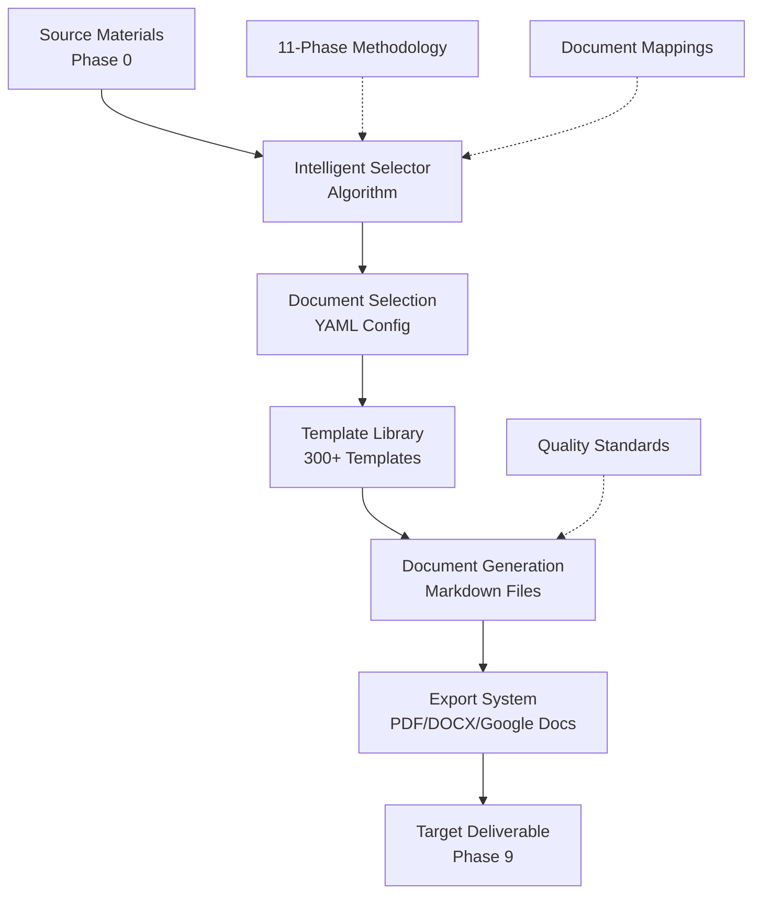

# Solution Desk Engine Framework Documentation

## Overview

This directory contains the complete framework design documentation for the solution-desk-engine - a technical sales solutioning framework that transforms source materials into professional deliverables using intelligent document selection.

## Framework Status

🔧 **Current Phase**: Framework Design Complete
📋 **Methodology**: 11-Phase Technical Sales Framework
🧠 **Intelligence**: Document selection algorithm defined
📄 **Templates**: Organization planned, 1% implemented
🚧 **Implementation**: Ready for development

## Core Documents

### 1. [11-Phase Methodology](11-phase-methodology.md)
**The foundation document** - Complete description of the proven 11-phase methodology (0-source through 10-audit) with ~300 document types organized by phase.

**Key Sections**:
- Phase-by-phase breakdown with purposes and document types
- Core principle: "We ALWAYS create our own documents to our standards"
- Configuration system using YAML for document control
- Quality standards and framework assets

### 2. [Intelligent Selection Algorithm](intelligent-selection-algorithm.md)
**The brain of the system** - Detailed specification of the algorithm that analyzes source materials and selects the minimum viable document set for any target deliverable.

**Key Sections**:
- 5-phase algorithm: Source Analysis → Gap Analysis → Document Selection → Generation Control
- Selection rules and optimization strategies
- YAML configuration generation
- Quality validation and human override capabilities

### 3. [Document Mappings](document-mappings.md)
**The complete catalog** - Comprehensive mapping of all ~300 document types across the 11 phases, showing relationships, dependencies, and selection criteria.

**Key Sections**:
- Phase-by-phase document listings with priority levels
- Selection criteria for each document type
- Template mappings and dependencies
- Cross-phase information flow requirements

### 4. [Templates Organization Assessment](templates-organization-assessment.md)
**Implementation roadmap** - Current state analysis and development plan for the template library that powers document generation.

**Key Sections**:
- Current template coverage (3/300+ templates)
- Recommended hierarchical organization structure
- Priority development plan (15 core → 50 essential → 235+ complete)
- Template quality standards and development process

## Framework Architecture

## Key Design Principles

### 1. Intelligence over Configuration
- System analyzes source and target to make smart selections
- Minimal user configuration required
- Algorithm learns and improves over time

### 2. Quality over Quantity
- Generate only necessary documents (not all 300+)
- Always create to professional standards
- Enforce citation and validation requirements

### 3. Proven Methodology
- Based on real successful engagements
- 11-phase structure tested in production
- Flexible enough for different opportunity types

### 4. Template-Driven Generation
- Standardized templates ensure consistency
- Professional formatting and branding
- Extensible for new document types

## Implementation Readiness

### ✅ Complete
- **Framework Design**: All major components designed
- **Algorithm Specification**: Detailed implementation guide
- **Document Catalog**: Complete mapping of 300+ document types
- **Quality Standards**: Citation and validation requirements
- **Export Infrastructure**: Multi-format conversion ready

### 🚧 In Progress
- **Template Library**: 3 of 300+ templates implemented
- **Core Implementation**: Python modules removed, ready for rebuild

### ❌ Not Started
- **Algorithm Implementation**: Python code for intelligent selection
- **Template Development**: 297+ templates need creation
- **CLI Commands**: User interface for framework operations
- **Testing Framework**: Validation of algorithm and templates

## Development Priority

### Phase 1: Minimal Viable Product
1. **15 Core Templates** - Essential documents for basic functionality
2. **Basic Algorithm** - Simple source/target analysis with manual overrides
3. **Core CLI Commands** - `create`, `analyze`, `generate`, `export`
4. **Single Use Case** - Google DAF SOW generation from POC requirements

### Phase 2: Production Ready
1. **50 Essential Templates** - Cover common selection scenarios
2. **Full Algorithm** - Automated gap analysis and optimization
3. **Quality Validation** - Automated citation and completeness checking
4. **Multiple Use Cases** - Enterprise RFPs, consulting proposals

### Phase 3: Complete Framework
1. **300+ Templates** - Full document library
2. **Learning Algorithm** - Success tracking and selection improvement
3. **Industry Specialization** - Vertical-specific document sets
4. **Integration Platform** - APIs and external tool connections

## Getting Started

For implementation, start with:
1. Review the [11-phase methodology](11-phase-methodology.md) to understand the framework
2. Study the [intelligent selection algorithm](intelligent-selection-algorithm.md) for implementation approach
3. Use [document mappings](document-mappings.md) to understand document relationships
4. Follow [templates organization assessment](templates-organization-assessment.md) for template development

The framework is comprehensively designed and ready for implementation. The biggest development effort will be creating the 300+ document templates, but the intelligent selection ensures most projects will only need 10-20 documents, making the system immediately useful even with partial template coverage.
