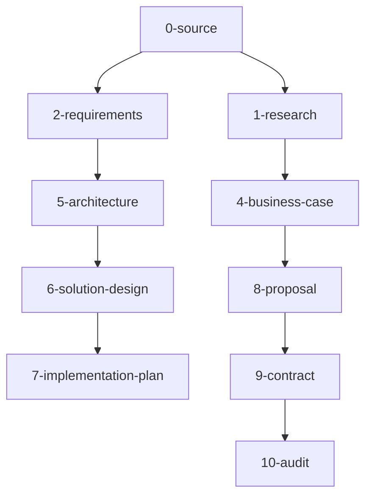

# Complete Document Mappings - 11-Phase Framework

## Overview
This document provides comprehensive mappings of all ~300 document types across the 11-phase methodology, showing relationships, dependencies, and selection criteria.

## Phase 0: Source Materials (Input Collection)

**Purpose**: Organize and catalog all source materials
**Selection Logic**: Always collect everything available

| Document | Priority | Selection Criteria | Template |
|----------|----------|-------------------|----------|
| original-requirements.md | REQUIRED | Always | source-materials-template.md |
| client-presentations.md | CONDITIONAL | If presentations exist | presentation-summary-template.md |
| vendor-specifications.md | CONDITIONAL | If vendor docs exist | vendor-spec-template.md |
| meeting-notes.md | CONDITIONAL | If meeting records exist | meeting-summary-template.md |
| email-communications.md | CONDITIONAL | If email threads exist | communication-template.md |

## Phase 1: Research & Discovery (~30 Documents)

**Purpose**: Market research, industry analysis, opportunity validation
**Selection Logic**: Based on source data completeness and target requirements

### Market Analysis Documents
| Document | Priority | Selection Criteria | Template |
|----------|----------|-------------------|----------|
| market-size-analysis.md | REQUIRED | Always for business case | market-analysis-template.md |
| industry-trends.md | HIGH | If target = enterprise SOW | industry-trends-template.md |
| competitive-landscape.md | CONDITIONAL | If competitive situation | competitive-analysis-template.md |
| market-segmentation.md | MEDIUM | If multiple customer types | segmentation-template.md |

### Financial Research Documents
| Document | Priority | Selection Criteria | Template |
|----------|----------|-------------------|----------|
| roi-patterns.md | REQUIRED | If source lacks ROI data | roi-patterns-template.md |
| market-financial-analysis.md | HIGH | If target requires financials | market-financial-template.md |
| cost-benchmarking.md | MEDIUM | If cost comparison needed | cost-benchmark-template.md |
| pricing-strategy.md | CONDITIONAL | If pricing not defined | pricing-strategy-template.md |

### Technology Research Documents
| Document | Priority | Selection Criteria | Template |
|----------|----------|-------------------|----------|
| technology-landscape.md | HIGH | If new technology stack | tech-landscape-template.md |
| vendor-ecosystem.md | MEDIUM | If vendor selection needed | vendor-ecosystem-template.md |
| implementation-patterns.md | HIGH | If implementation approach unclear | implementation-patterns-template.md |
| best-practices.md | MEDIUM | For knowledge transfer | best-practices-template.md |

### Industry-Specific Documents
| Document | Priority | Selection Criteria | Template |
|----------|----------|-------------------|----------|
| regulatory-landscape.md | HIGH | If regulated industry | regulatory-template.md |
| compliance-requirements.md | HIGH | If compliance mentioned | compliance-template.md |
| industry-standards.md | MEDIUM | If standards referenced | standards-template.md |

## Phase 2: Requirements Analysis (~20 Documents)

**Purpose**: Functional and non-functional requirements with traceability
**Selection Logic**: Based on technical complexity and source completeness

### Core Requirements Documents
| Document | Priority | Selection Criteria | Template |
|----------|----------|-------------------|----------|
| functional-requirements.md | REQUIRED | Always | functional-req-template.md |
| non-functional-requirements.md | REQUIRED | Always | non-functional-req-template.md |
| user-requirements.md | HIGH | If user-facing system | user-req-template.md |
| system-requirements.md | HIGH | If system integration | system-req-template.md |

### Integration Requirements Documents
| Document | Priority | Selection Criteria | Template |
|----------|----------|-------------------|----------|
| integration-requirements.md | HIGH | If existing systems mentioned | integration-req-template.md |
| data-requirements.md | HIGH | If data processing involved | data-req-template.md |
| api-requirements.md | MEDIUM | If API development needed | api-req-template.md |
| interface-requirements.md | MEDIUM | If external interfaces | interface-req-template.md |

### Quality Requirements Documents
| Document | Priority | Selection Criteria | Template |
|----------|----------|-------------------|----------|
| performance-requirements.md | HIGH | If performance critical | performance-req-template.md |
| security-requirements.md | HIGH | If security mentioned | security-req-template.md |
| reliability-requirements.md | MEDIUM | If high availability needed | reliability-req-template.md |
| scalability-requirements.md | MEDIUM | If growth expected | scalability-req-template.md |

## Phase 3: Stakeholder Analysis (~25 Documents)

**Purpose**: Stakeholder mapping, user analysis, organizational impact
**Selection Logic**: Based on organizational complexity and user count

### Stakeholder Management Documents
| Document | Priority | Selection Criteria | Template |
|----------|----------|-------------------|----------|
| stakeholder-mapping.md | HIGH | If multiple departments | stakeholder-mapping-template.md |
| stakeholder-analysis.md | MEDIUM | If complex org structure | stakeholder-analysis-template.md |
| influence-network.md | MEDIUM | If political complexity | influence-network-template.md |
| communication-plan.md | HIGH | If >50 users affected | communication-plan-template.md |

### User Analysis Documents
| Document | Priority | Selection Criteria | Template |
|----------|----------|-------------------|----------|
| user-personas.md | HIGH | If user-facing system | user-personas-template.md |
| user-journey-mapping.md | HIGH | If UX component | user-journey-template.md |
| user-adoption-strategy.md | MEDIUM | If >100 users | adoption-strategy-template.md |
| training-requirements.md | MEDIUM | If training needed | training-req-template.md |

### Change Management Documents
| Document | Priority | Selection Criteria | Template |
|----------|----------|-------------------|----------|
| change-impact-assessment.md | HIGH | If process changes | change-impact-template.md |
| change-management-plan.md | MEDIUM | If organizational change | change-mgmt-template.md |
| risk-assessment.md | HIGH | If change risks identified | risk-assessment-template.md |

## Phase 4: Business Case Development (~15 Documents)

**Purpose**: ROI analysis, value proposition, financial justification
**Selection Logic**: Based on target deliverable and financial requirements

### Financial Analysis Documents
| Document | Priority | Selection Criteria | Template |
|----------|----------|-------------------|----------|
| business-case.md | REQUIRED | Always | business-case-template.md |
| roi-analysis.md | REQUIRED | Always | roi-analysis-template.md |
| cost-benefit-analysis.md | HIGH | If detailed costs needed | cost-benefit-template.md |
| financial-projections.md | HIGH | If multi-year project | financial-projections-template.md |

### Value Proposition Documents
| Document | Priority | Selection Criteria | Template |
|----------|----------|-------------------|----------|
| value-proposition.md | REQUIRED | Always | value-prop-template.md |
| benefits-realization.md | HIGH | If benefits tracking needed | benefits-realization-template.md |
| success-metrics.md | HIGH | Always for measurable outcomes | success-metrics-template.md |

### Risk and Investment Documents
| Document | Priority | Selection Criteria | Template |
|----------|----------|-------------------|----------|
| investment-analysis.md | MEDIUM | If large investment | investment-analysis-template.md |
| risk-mitigation.md | HIGH | If high-risk project | risk-mitigation-template.md |
| business-continuity.md | MEDIUM | If mission-critical system | business-continuity-template.md |

## Phase 5: Architecture Design (~30 Documents)

**Purpose**: High-level technical architecture and design principles
**Selection Logic**: Based on technical complexity and integration requirements

### Core Architecture Documents
| Document | Priority | Selection Criteria | Template |
|----------|----------|-------------------|----------|
| solution-architecture.md | REQUIRED | Always | solution-architecture-template.md |
| system-architecture.md | HIGH | If complex system | system-architecture-template.md |
| integration-architecture.md | HIGH | If system integration | integration-architecture-template.md |
| data-architecture.md | HIGH | If data processing | data-architecture-template.md |

### Cloud Architecture Documents
| Document | Priority | Selection Criteria | Template |
|----------|----------|-------------------|----------|
| gcp-architecture.md | HIGH | If GCP deployment | gcp-architecture-template.md |
| cloud-services-design.md | HIGH | If cloud-native | cloud-services-template.md |
| multi-cloud-strategy.md | MEDIUM | If multi-cloud | multi-cloud-template.md |
| hybrid-architecture.md | MEDIUM | If hybrid deployment | hybrid-architecture-template.md |

### Specialized Architecture Documents
| Document | Priority | Selection Criteria | Template |
|----------|----------|-------------------|----------|
| security-architecture.md | HIGH | If security critical | security-architecture-template.md |
| performance-architecture.md | MEDIUM | If performance critical | performance-architecture-template.md |
| scalability-design.md | MEDIUM | If scalability required | scalability-design-template.md |
| disaster-recovery-design.md | MEDIUM | If DR required | dr-design-template.md |

## Phase 6: Solution Design (~35 Documents)

**Purpose**: Detailed component specifications and implementation details
**Selection Logic**: Based on development complexity and technical requirements

### Detailed Design Documents
| Document | Priority | Selection Criteria | Template |
|----------|----------|-------------------|----------|
| detailed-design.md | HIGH | If custom development | detailed-design-template.md |
| component-specifications.md | HIGH | If multiple components | component-spec-template.md |
| interface-design.md | HIGH | If external interfaces | interface-design-template.md |
| database-design.md | HIGH | If database component | database-design-template.md |

### Development Documents
| Document | Priority | Selection Criteria | Template |
|----------|----------|-------------------|----------|
| api-design.md | HIGH | If API development | api-design-template.md |
| service-design.md | MEDIUM | If microservices | service-design-template.md |
| workflow-design.md | MEDIUM | If business workflows | workflow-design-template.md |
| batch-processing-design.md | MEDIUM | If batch processing | batch-processing-template.md |

### Quality Assurance Documents
| Document | Priority | Selection Criteria | Template |
|----------|----------|-------------------|----------|
| testing-strategy.md | HIGH | Always for development | testing-strategy-template.md |
| quality-assurance-plan.md | HIGH | Always for development | qa-plan-template.md |
| performance-testing-plan.md | MEDIUM | If performance critical | perf-testing-template.md |

## Phase 7: Implementation Planning (~30 Documents)

**Purpose**: Execution roadmap, resource allocation, project management
**Selection Logic**: Based on project complexity and timeline

### Project Management Documents
| Document | Priority | Selection Criteria | Template |
|----------|----------|-------------------|----------|
| project-plan.md | REQUIRED | Always | project-plan-template.md |
| timeline-and-milestones.md | REQUIRED | Always | timeline-template.md |
| resource-allocation.md | HIGH | Always | resource-allocation-template.md |
| work-breakdown.md | HIGH | If complex project | wbs-template.md |

### Resource Planning Documents
| Document | Priority | Selection Criteria | Template |
|----------|----------|-------------------|----------|
| staffing-plan.md | HIGH | If team building needed | staffing-plan-template.md |
| skills-assessment.md | MEDIUM | If skills gap | skills-assessment-template.md |
| training-plan.md | MEDIUM | If training required | training-plan-template.md |

### Cloud Resource Documents
| Document | Priority | Selection Criteria | Template |
|----------|----------|-------------------|----------|
| gcp-resource-allocation.md | HIGH | If GCP deployment | gcp-resource-allocation-template.md |
| cost-optimization-plan.md | HIGH | If cost management important | cost-optimization-template.md |
| capacity-planning.md | MEDIUM | If scalability planning | capacity-planning-template.md |

## Phase 8: Proposal Materials (~20 Documents)

**Purpose**: Client-facing presentations and proposal documents
**Selection Logic**: Based on target audience and presentation requirements

### Executive Materials
| Document | Priority | Selection Criteria | Template |
|----------|----------|-------------------|----------|
| executive-presentation.md | HIGH | If executive audience | executive-presentation-template.md |
| executive-summary.md | REQUIRED | Always | executive-summary-template.md |
| business-overview.md | HIGH | If business focus | business-overview-template.md |

### Technical Materials
| Document | Priority | Selection Criteria | Template |
|----------|----------|-------------------|----------|
| technical-presentation.md | HIGH | If technical audience | technical-presentation-template.md |
| solution-overview.md | HIGH | Always for technical solution | solution-overview-template.md |
| demo-script.md | MEDIUM | If demo required | demo-script-template.md |

### Commercial Materials
| Document | Priority | Selection Criteria | Template |
|----------|----------|-------------------|----------|
| pricing-proposal.md | HIGH | If pricing discussion | pricing-proposal-template.md |
| commercial-terms.md | MEDIUM | If contract negotiation | commercial-terms-template.md |

## Phase 9: Contract Documents (~15 Documents)

**Purpose**: Final deliverable - SOW, contracts, and legal documents
**Selection Logic**: Based on contract type and legal requirements

### Core Contract Documents
| Document | Priority | Selection Criteria | Template |
|----------|----------|-------------------|----------|
| statement-of-work.md | REQUIRED | Always | sow-template.md |
| master-service-agreement.md | HIGH | If MSA required | msa-template.md |
| work-order.md | MEDIUM | If work order structure | work-order-template.md |

### Service Level Documents
| Document | Priority | Selection Criteria | Template |
|----------|----------|-------------------|----------|
| service-level-agreement.md | HIGH | If ongoing service | sla-template.md |
| support-agreement.md | MEDIUM | If support included | support-agreement-template.md |
| maintenance-agreement.md | MEDIUM | If maintenance included | maintenance-agreement-template.md |

### Legal Documents
| Document | Priority | Selection Criteria | Template |
|----------|----------|-------------------|----------|
| data-processing-agreement.md | HIGH | If data processing | dpa-template.md |
| intellectual-property-agreement.md | MEDIUM | If IP concerns | ip-agreement-template.md |
| confidentiality-agreement.md | HIGH | If confidential data | nda-template.md |

## Phase 10: Audit & Validation (~25 Documents)

**Purpose**: Quality validation, completeness checks, final review
**Selection Logic**: Based on delivery requirements and quality standards

### Quality Validation Documents
| Document | Priority | Selection Criteria | Template |
|----------|----------|-------------------|----------|
| document-completeness-audit.md | REQUIRED | Always | completeness-audit-template.md |
| technical-review.md | HIGH | If technical delivery | technical-review-template.md |
| business-case-validation.md | HIGH | If business case critical | business-validation-template.md |

### Compliance Documents
| Document | Priority | Selection Criteria | Template |
|----------|----------|-------------------|----------|
| legal-compliance-review.md | HIGH | If legal requirements | legal-review-template.md |
| security-compliance-audit.md | HIGH | If security requirements | security-audit-template.md |
| regulatory-compliance.md | MEDIUM | If regulated industry | regulatory-compliance-template.md |

### Final Package Documents
| Document | Priority | Selection Criteria | Template |
|----------|----------|-------------------|----------|
| deliverable-package.md | REQUIRED | Always | deliverable-package-template.md |
| handover-documentation.md | HIGH | If knowledge transfer | handover-template.md |
| lessons-learned.md | MEDIUM | For process improvement | lessons-learned-template.md |

## Document Dependencies

### Cross-Phase Dependencies

### Information Flow Requirements
- **Financial Data**: 1-research → 4-business-case → 8-proposal → 9-contract
- **Technical Specs**: 2-requirements → 5-architecture → 6-solution-design → 7-implementation-plan
- **Stakeholder Info**: 3-analysis → 7-implementation-plan → 8-proposal
- **Risk Analysis**: 3-analysis → 4-business-case → 7-implementation-plan

This comprehensive mapping ensures the intelligent selection algorithm can make informed decisions about which documents are needed for any given source-to-target transformation.
