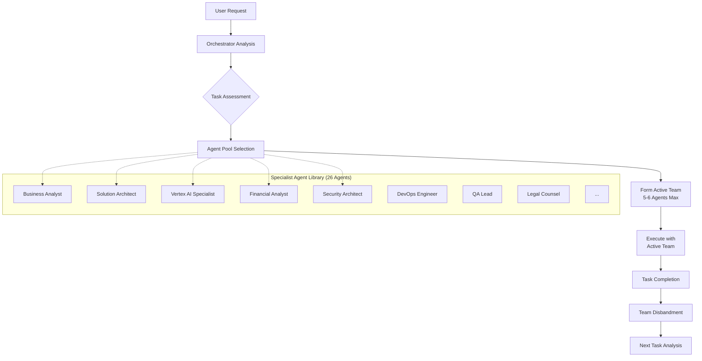

# Agent Orchestration Architecture - Dynamic Team Formation

## Overview

This document outlines the architecture and best practices for managing large agent teams in Claude Code, specifically the dynamic team formation pattern that allows for specialized expertise while maintaining orchestrator clarity and context efficiency.

## The Challenge: Large Agent Teams vs. Orchestrator Confusion

### Traditional Approach Problems
- **26+ agents active simultaneously** creates decision paralysis for the orchestrator
- **Overlapping responsibilities** cause confusion in agent selection
- **Context window pollution** from multiple agent descriptions
- **Maintenance overhead** keeping all agents aligned and consistent

### The Solution: Dynamic Team Formation

Instead of having all 26 agents competing for attention, we implement a **specialist pool with dynamic selection** pattern where the orchestrator intelligently forms lean, focused teams of 5-6 agents for specific tasks or phases.

## Architecture Pattern: Specialist Pool + Dynamic Selection



### Key Benefits

1. **No Orchestrator Confusion**: Only 5-6 agents active at any time
2. **Deep Specialization**: Access to 26 specialists when needed
3. **Context Efficiency**: Small active teams preserve context window
4. **Maximum Flexibility**: Different teams for different phases/tasks
5. **Clear Accountability**: Focused teams with defined roles

## Implementation Architecture

### Agent Pool Organization

#### Core Agents (Always Available)
```yaml
core_agents:
  business-analyst:
    phase: "0-source"
    role: "Requirements and document analysis"
    activation: "Always active for requirements clarity"

  project-manager:
    phase: "7-implementation"
    role: "Cross-phase coordination and delivery"
    activation: "Active during execution phases"
```

#### Specialist Pool (Selected Dynamically)
```yaml
specialist_pool:
  discovery_specialists:
    - solution-architect-gcp
    - vertex-ai-specialist
    - domain-expert
    - ux-researcher

  analysis_specialists:
    - requirements-engineer
    - process-analyst
    - change-management-specialist

  business_case_specialists:
    - financial-analyst
    - gcp-pricing-specialist

  architecture_specialists:
    - vertex-ai-architect
    - security-architect
    - data-architect
    - cloud-architect-gcp

  design_specialists:
    - ux-ui-designer
    - api-designer
    - ml-engineer

  implementation_specialists:
    - devops-engineer-gcp
    - qa-lead

  commercial_specialists:
    - proposal-writer
    - sales-engineer-gcp
    - legal-counsel
    - commercial-manager

  validation_specialists:
    - quality-assurance-auditor
    - technical-auditor
```

### Team Formation Strategies

#### 1. Phase-Based Team Formation

**Phase 1: Discovery Team**
```yaml
team_composition:
  lead: solution-architect-gcp
  specialists:
    - business-analyst (requirements)
    - vertex-ai-specialist (AI capabilities)
    - domain-expert (franchise knowledge)
    - ux-researcher (user needs)
  size: 5 agents
  duration: 2-3 weeks
  handoff_to: analysis_team
```

**Phase 4: Business Case Team**
```yaml
team_composition:
  lead: financial-analyst
  specialists:
    - business-analyst (requirements validation)
    - gcp-pricing-specialist (cost analysis)
    - solution-architect-gcp (technical validation)
    - commercial-manager (deal structuring)
  size: 5 agents
  duration: 1-2 weeks
  handoff_to: architecture_team
```

**Phase 7: Implementation Team**
```yaml
team_composition:
  lead: project-manager
  specialists:
    - devops-engineer-gcp (infrastructure)
    - ml-engineer (AI implementation)
    - qa-lead (quality assurance)
    - security-architect (security validation)
    - api-designer (integration)
  size: 6 agents
  duration: 8-12 weeks
  handoff_to: validation_team
```

#### 2. Task-Specific Team Formation

**Task: "Validate AI accuracy and create business case"**
```yaml
dynamic_team:
  orchestrator_analysis:
    - AI validation needed → vertex-ai-specialist
    - Business case required → financial-analyst
    - Cost analysis needed → gcp-pricing-specialist
    - Requirements validation → business-analyst
    - Architecture validation → solution-architect-gcp

  selected_team: [vertex-ai-specialist, financial-analyst, gcp-pricing-specialist, business-analyst, solution-architect-gcp]
  team_size: 5
  formation_reason: "Cross-functional validation task"
```

**Task: "Design security architecture and ensure compliance"**
```yaml
dynamic_team:
  orchestrator_analysis:
    - Security design needed → security-architect
    - Legal compliance required → legal-counsel
    - Architecture integration → solution-architect-gcp
    - Implementation planning → devops-engineer-gcp
    - Quality validation → qa-lead

  selected_team: [security-architect, legal-counsel, solution-architect-gcp, devops-engineer-gcp, qa-lead]
  team_size: 5
  formation_reason: "Security and compliance focus"
```

### Selection Algorithm Framework

#### Orchestrator Decision Matrix

```python
class AgentOrchestrator:
    def __init__(self):
        self.agent_pool = load_agent_library()
        self.active_team = []
        self.max_team_size = 6

    def select_team(self, task_description: str, current_phase: str) -> List[Agent]:
        """Select optimal team based on task and phase"""

        # Step 1: Analyze task requirements
        task_analysis = self.analyze_task(task_description)

        # Step 2: Identify required capabilities
        required_capabilities = self.extract_capabilities(task_analysis)

        # Step 3: Score agents by relevance
        agent_scores = self.score_agents(required_capabilities, current_phase)

        # Step 4: Select top agents ensuring no overlap
        selected_team = self.optimize_team_composition(agent_scores)

        return selected_team[:self.max_team_size]

    def analyze_task(self, description: str) -> Dict:
        """Extract task characteristics and requirements"""
        return {
            "domain": self.extract_domain(description),
            "complexity": self.assess_complexity(description),
            "skills_needed": self.extract_skills(description),
            "deliverables": self.identify_deliverables(description),
            "stakeholders": self.identify_stakeholders(description)
        }

    def score_agents(self, capabilities: List[str], phase: str) -> Dict[str, float]:
        """Score each agent's relevance for current task"""
        scores = {}

        for agent in self.agent_pool:
            score = 0.0

            # Capability match scoring
            for capability in capabilities:
                if capability in agent.expertise:
                    score += agent.expertise[capability] * 10

            # Phase alignment scoring
            if phase in agent.primary_phases:
                score += 20
            elif phase in agent.secondary_phases:
                score += 10

            # Specialization bonus
            if agent.is_specialist_for(capabilities):
                score += 15

            scores[agent.name] = score

        return scores
```

#### Team Composition Optimization

```python
def optimize_team_composition(self, agent_scores: Dict[str, float]) -> List[Agent]:
    """Optimize team for minimal overlap and maximum coverage"""

    # Sort agents by score
    ranked_agents = sorted(agent_scores.items(), key=lambda x: x[1], reverse=True)

    selected_team = []
    covered_capabilities = set()

    for agent_name, score in ranked_agents:
        agent = self.agent_pool[agent_name]

        # Check for capability overlap
        overlap_ratio = len(agent.capabilities & covered_capabilities) / len(agent.capabilities)

        # Select if minimal overlap and team not full
        if overlap_ratio < 0.3 and len(selected_team) < self.max_team_size:
            selected_team.append(agent)
            covered_capabilities.update(agent.capabilities)

        # Stop when team is full
        if len(selected_team) >= self.max_team_size:
            break

    return selected_team
```

## Agent Design Principles for Orchestration

### 1. Clear Non-Overlapping Descriptions

**Good Example**:
```yaml
name: vertex-ai-specialist
description: "Vertex AI and ML architecture specialist for Phase 1. Use PROACTIVELY for ML model selection, Vertex AI service planning, data pipeline design, and AI capability assessment. Triggers: AI/ML requirements, Vertex AI architecture, model selection, data processing needs."

name: security-architect
description: "Security architecture specialist for Phase 5. Use PROACTIVELY for security design, compliance planning, threat modeling, and security controls definition. Triggers: security architecture, compliance requirements, threat modeling, security controls."
```

**Poor Example** (creates confusion):
```yaml
name: solution-architect
description: "General architecture specialist. Use for any architecture needs, technical design, system planning, and solution development."

name: technical-architect
description: "Technical design specialist. Use for architecture work, system design, technical planning, and solution architecture."
```

### 2. Specialization Over Generalization

**Principle**: Each agent should have a narrow, deep expertise rather than broad, shallow knowledge.

```yaml
# ✅ Good: Highly specialized
name: gcp-pricing-specialist
description: "GCP pricing and cost analysis specialist for Phase 4. Use PROACTIVELY for cloud cost estimation, pricing model analysis, consumption forecasting, and cost optimization recommendations."

# ❌ Poor: Too general
name: cloud-specialist
description: "Cloud computing specialist. Use for any cloud-related tasks, planning, or implementation."
```

### 3. Trigger Pattern Optimization

**Effective Trigger Patterns**:
```yaml
vertex-ai-specialist:
  triggers: ["AI/ML requirements", "Vertex AI architecture", "model selection", "data processing needs"]

financial-analyst:
  triggers: ["ROI calculation", "business case", "cost analysis", "financial modeling"]

security-architect:
  triggers: ["security architecture", "compliance requirements", "threat modeling", "security controls"]
```

These patterns help the orchestrator make clear decisions about which agent to invoke.

## Context Management Strategy

### Context Preservation Techniques

#### 1. Team Handoff Protocols
```python
class TeamHandoff:
    def __init__(self):
        self.context_summary = {}
        self.key_decisions = []
        self.open_issues = []

    def prepare_handoff(self, from_team: List[Agent], to_team: List[Agent]):
        """Prepare context handoff between teams"""

        # Summarize key outputs from current team
        self.context_summary = {
            "phase_completed": from_team.current_phase,
            "deliverables_created": from_team.deliverables,
            "key_decisions": from_team.decisions,
            "assumptions_made": from_team.assumptions,
            "risks_identified": from_team.risks
        }

        # Identify continuity requirements
        continuity_needs = self.analyze_continuity_needs(from_team, to_team)

        # Transfer critical context
        self.transfer_context(to_team, self.context_summary, continuity_needs)
```

#### 2. Persistent Context Storage
```yaml
context_management:
  project_memory:
    location: ".solution-desk-engine/context/"
    structure:
      - phase_summaries/
      - decision_log/
      - requirements_matrix/
      - architecture_decisions/
      - risk_register/

  context_sharing:
    between_agents: "Shared project memory access"
    between_teams: "Formal handoff documents"
    between_phases: "Phase completion summaries"
```

#### 3. Context Compression Techniques
```python
def compress_context_for_new_team(self, full_context: Dict, new_team: List[Agent]) -> Dict:
    """Compress context to essential information for new team"""

    # Identify what the new team needs to know
    relevant_context = {}

    for agent in new_team:
        agent_needs = agent.context_requirements

        for need in agent_needs:
            if need in full_context:
                relevant_context[need] = full_context[need]

    # Summarize verbose information
    relevant_context["summary"] = self.generate_executive_summary(full_context)

    return relevant_context
```

## Best Practices for Implementation

### 1. Agent Library Management

#### Naming Conventions
```yaml
naming_pattern: "{role}-{specialization}-agent"
examples:
  - "business-analyst-agent"
  - "vertex-ai-specialist-agent"
  - "security-architect-agent"
  - "devops-engineer-gcp-agent"
```

#### Version Control Strategy
```bash
# Agent library structure
.claude/agents/
├── core/
│   ├── business-analyst-agent.md
│   └── project-manager-agent.md
├── specialists/
│   ├── ai-ml/
│   │   ├── vertex-ai-specialist-agent.md
│   │   ├── ml-engineer-agent.md
│   │   └── vertex-ai-architect-agent.md
│   ├── architecture/
│   │   ├── solution-architect-gcp-agent.md
│   │   ├── security-architect-agent.md
│   │   └── data-architect-agent.md
│   └── business/
│       ├── financial-analyst-agent.md
│       ├── commercial-manager-agent.md
│       └── legal-counsel-agent.md
```

### 2. Team Formation Monitoring

#### Metrics to Track
```yaml
orchestration_metrics:
  team_formation:
    - selection_accuracy: "% of optimal team selections"
    - overlap_minimization: "Average capability overlap in teams"
    - coverage_completeness: "% of required capabilities covered"

  team_performance:
    - task_completion_rate: "% of tasks completed successfully"
    - handoff_efficiency: "Context loss during team transitions"
    - stakeholder_satisfaction: "Stakeholder feedback on team effectiveness"

  resource_efficiency:
    - context_utilization: "Context window efficiency"
    - agent_utilization: "% utilization of specialist agents"
    - team_size_optimization: "Average team size vs. effectiveness"
```

### 3. Continuous Improvement Framework

#### Team Selection Optimization
```python
class OrchestrationOptimizer:
    def __init__(self):
        self.selection_history = []
        self.performance_data = {}

    def analyze_team_performance(self, team: List[Agent], task_outcome: Dict):
        """Analyze team performance and update selection algorithm"""

        performance_score = self.calculate_performance_score(task_outcome)

        # Store performance data
        self.performance_data[team.composition_hash] = {
            "performance_score": performance_score,
            "task_type": task_outcome["task_type"],
            "completion_time": task_outcome["completion_time"],
            "stakeholder_satisfaction": task_outcome["satisfaction_score"]
        }

        # Update selection weights
        self.update_selection_algorithm(team, performance_score)

    def update_selection_algorithm(self, team: List[Agent], performance: float):
        """Update agent selection weights based on performance"""

        if performance > 0.8:  # High performance
            for agent in team:
                agent.selection_weight += 0.1

        elif performance < 0.6:  # Poor performance
            for agent in team:
                agent.selection_weight -= 0.05

        # Normalize weights
        self.normalize_selection_weights()
```

## Example Team Formations

### Phase 1: Discovery and Requirements
```yaml
discovery_team:
  lead: solution-architect-gcp
  composition:
    - business-analyst (requirements gathering)
    - vertex-ai-specialist (AI capability assessment)
    - domain-expert (franchise industry knowledge)
    - ux-researcher (user experience analysis)

  objectives:
    - Technical feasibility assessment
    - Requirements documentation
    - AI/ML capability evaluation
    - User experience requirements

  deliverables:
    - Solution architecture overview
    - Requirements specification
    - AI/ML assessment report
    - User experience recommendations
```

### Phase 4: Business Case Development
```yaml
business_case_team:
  lead: financial-analyst
  composition:
    - gcp-pricing-specialist (cost analysis)
    - business-analyst (requirements validation)
    - solution-architect-gcp (technical cost validation)
    - commercial-manager (deal structuring)

  objectives:
    - ROI calculation and business case
    - Cost optimization analysis
    - Commercial strategy development
    - Risk assessment and mitigation

  deliverables:
    - Business case document
    - ROI analysis and projections
    - Commercial strategy
    - Risk register and mitigation plans
```

### Phase 7: Implementation Planning
```yaml
implementation_team:
  lead: project-manager
  composition:
    - devops-engineer-gcp (infrastructure automation)
    - ml-engineer (AI/ML implementation)
    - qa-lead (quality assurance)
    - security-architect (security implementation)
    - api-designer (integration planning)

  objectives:
    - Implementation plan development
    - Infrastructure automation design
    - Quality assurance strategy
    - Security implementation planning

  deliverables:
    - Implementation project plan
    - Infrastructure as code
    - QA strategy and test plans
    - Security implementation guide
```

## Conclusion

The Dynamic Team Formation pattern provides the best of both worlds:
- **Deep Specialization**: Access to 26 expert agents when needed
- **Orchestrator Clarity**: Clean 5-6 agent teams prevent confusion
- **Context Efficiency**: Small active teams preserve context window
- **Maximum Flexibility**: Different teams for different phases and tasks

This architecture enables sophisticated, specialized AI assistance while maintaining the simplicity and clarity that makes the system effective and reliable.

## Implementation Checklist

- [ ] **Agent Library Complete**: All 26 specialist agents created and tested
- [ ] **Orchestrator Logic**: Team selection algorithm implemented
- [ ] **Context Management**: Handoff protocols and persistent context storage
- [ ] **Monitoring Framework**: Metrics collection and optimization feedback loops
- [ ] **Documentation**: Agent descriptions optimized for clear triggering
- [ ] **Testing**: Team formation scenarios tested and validated
- [ ] **Continuous Improvement**: Performance tracking and algorithm updates implemented
