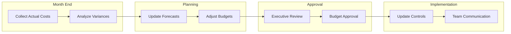
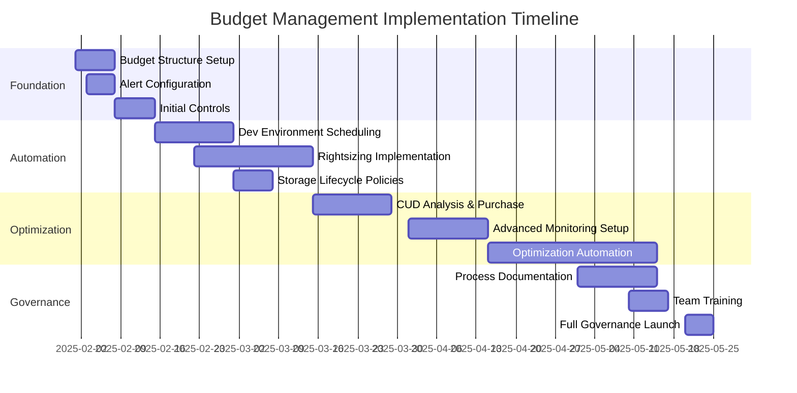

# Cloud Budget Management Plan Template

*This template should be used for 7-implementation-plan/cloud-budget-management-plan.md*

## Executive Summary

[One-paragraph overview of cloud budget governance framework and cost management strategy]

## Budget Governance Framework

### Budget Hierarchy Structure

```mermaid
graph TB
    subgraph "Master Budget Authority"
        MASTER[Project Master Budget<br/>$[Amount]/month<br/>Executive Oversight]
    end

    subgraph "Environment Budgets"
        DEV[Development Budget<br/>$[Amount]/month<br/>20% of master]
        STAGING[Staging Budget<br/>$[Amount]/month<br/>15% of master]
        PROD[Production Budget<br/>$[Amount]/month<br/>65% of master]
    end

    subgraph "Service-Level Budgets"
        CES[CES Platform<br/>$[Amount]/month]
        COMPUTE[Compute Infrastructure<br/>$[Amount]/month]
        STORAGE[Storage Services<br/>$[Amount]/month]
        NETWORK[Networking<br/>$[Amount]/month]
    end

    MASTER --> DEV
    MASTER --> STAGING
    MASTER --> PROD

    PROD --> CES
    PROD --> COMPUTE
    PROD --> STORAGE
    PROD --> NETWORK
```

### Budget Authority Matrix

| Budget Level | Authority | Approval Required | Spending Limit |
|--------------|-----------|------------------|----------------|
| **Master Budget** | Executive Sponsor | Board/C-Level | Unlimited within approved budget |
| **Environment Budgets** | Project Manager | Executive Sponsor | Environment allocation limit |
| **Service Budgets** | Technical Lead | Project Manager | Service allocation limit |
| **Emergency Overrides** | Executive Sponsor | Real-time approval | 20% of monthly budget |

## Monthly Budget Allocation

### POV Phase Budget (Months 1-2)
```yaml
POV_Monthly_Budget: "$[Amount]"

Environment_Allocation:
  development:
    budget: "$[Amount] (40%)"
    purpose: "POV development and testing"
    key_services: ["CES Platform", "Cloud Run", "Storage"]

  staging:
    budget: "$[Amount] (35%)"
    purpose: "POV validation and demos"
    key_services: ["CES Staging", "Load Testing", "Monitoring"]

  production:
    budget: "$[Amount] (25%)"
    purpose: "POV demonstration environment"
    key_services: ["CES Demo", "Security", "Backup"]

Service_Breakdown:
  ces_platform: "$[Amount] (60%)"
  compute_infrastructure: "$[Amount] (20%)"
  storage_data: "$[Amount] (10%)"
  networking: "$[Amount] (5%)"
  monitoring_security: "$[Amount] (5%)"
```

### Pilot Phase Budget (Months 3-6)
```yaml
Pilot_Monthly_Budget: "$[Amount]"

Environment_Allocation:
  development:
    budget: "$[Amount] (25%)"
    purpose: "Feature development and integration"
    scaling_factor: "2x POV capacity"

  staging:
    budget: "$[Amount] (30%)"
    purpose: "Integration testing and performance validation"
    scaling_factor: "5x POV capacity"

  production:
    budget: "$[Amount] (45%)"
    purpose: "Pilot deployment and user acceptance"
    scaling_factor: "10x POV capacity"

Service_Breakdown:
  ces_platform: "$[Amount] (55%)"
  compute_infrastructure: "$[Amount] (25%)"
  storage_data: "$[Amount] (10%)"
  networking: "$[Amount] (5%)"
  monitoring_security: "$[Amount] (5%)"
```

### Production Phase Budget (Months 7-12)
```yaml
Production_Monthly_Budget: "$[Amount]"

Environment_Allocation:
  development:
    budget: "$[Amount] (15%)"
    purpose: "Ongoing feature development"
    optimization: "Automated scheduling for 60% cost reduction"

  staging:
    budget: "$[Amount] (20%)"
    purpose: "Pre-production testing and validation"
    optimization: "On-demand scaling during business hours"

  production:
    budget: "$[Amount] (65%)"
    purpose: "Full-scale enterprise deployment"
    optimization: "CUDs and sustained use discounts applied"

Service_Breakdown:
  ces_enterprise: "$[Amount] (50%)"
  compute_infrastructure: "$[Amount] (30%)"
  storage_data: "$[Amount] (10%)"
  networking: "$[Amount] (5%)"
  monitoring_security: "$[Amount] (5%)"
```

## Budget Control Mechanisms

### Alert Thresholds & Escalation

```yaml
Alert_Configuration:
  budget_thresholds:
    warning_50_percent:
      action: "Email notification to project team"
      frequency: "Daily monitoring activation"
      recipients: ["project-team@company.com"]

    critical_80_percent:
      action: "Escalation to project manager + cost review meeting"
      frequency: "Real-time monitoring"
      recipients: ["pm@company.com", "finance@company.com"]

    emergency_95_percent:
      action: "Executive notification + immediate spending freeze"
      frequency: "Immediate alert"
      recipients: ["executive-sponsor@company.com"]

    overage_100_percent:
      action: "Automatic resource scaling restrictions"
      frequency: "Immediate enforcement"
      automation: "Prevent new resource creation"
```

### Automated Budget Controls

#### Development Environment Controls
```yaml
Development_Automation:
  resource_scheduling:
    weekday_schedule: "8 AM - 8 PM (auto shutdown after hours)"
    weekend_schedule: "Complete shutdown Saturday-Sunday"
    holiday_schedule: "Shutdown during company holidays"
    estimated_savings: "60-70% cost reduction"

  resource_limits:
    max_compute_instances: 10
    max_storage_gb: 100
    max_bigquery_slots: 100
    auto_scaling_limits: "Scale down to 0 instances during off-hours"
```

#### Production Environment Controls
```yaml
Production_Automation:
  scaling_policies:
    auto_scaling_triggers: "CPU >75% for 5 minutes"
    max_instances: 50
    min_instances: 5
    scale_down_delay: "15 minutes to prevent thrashing"

  cost_protection:
    daily_spend_limit: "$[Amount] per day"
    anomaly_detection: "Alert on >50% increase from baseline"
    automatic_quota_management: "Prevent runaway resource creation"
```

### Manual Override Procedures

#### Emergency Budget Override Process
1. **Incident Declaration**: Project manager or technical lead declares budget emergency
2. **Executive Notification**: Immediate notification to executive sponsor
3. **Justification Documentation**: Business case for budget override required
4. **Approval Timeline**: Executive approval required within 2 hours
5. **Override Limits**: Maximum 20% of monthly budget increase
6. **Review Process**: Post-incident review within 24 hours

## Cost Monitoring & Reporting

### Daily Monitoring Dashboard

```yaml
Daily_Metrics:
  current_spend:
    today: "$[Amount] (vs $[Budget] daily target)"
    week_to_date: "$[Amount] (vs $[Budget] weekly target)"
    month_to_date: "$[Amount] (vs $[Budget] monthly budget)"

  service_breakdown:
    ces_platform: "$[Amount] ([X]% of service budget)"
    compute: "$[Amount] ([X]% of service budget)"
    storage: "$[Amount] ([X]% of service budget)"
    networking: "$[Amount] ([X]% of service budget)"

  environment_breakdown:
    development: "$[Amount] ([X]% of env budget)"
    staging: "$[Amount] ([X]% of env budget)"
    production: "$[Amount] ([X]% of env budget)"
```

### Weekly Cost Analysis Report

#### Report Structure
```markdown
# Weekly GCP Cost Analysis Report
## Week of [Date]

### Budget Performance Summary
- **Total Spend**: $[Amount] (vs $[Budget] weekly target)
- **Budget Utilization**: [X]% of monthly budget consumed
- **Projection**: On track / Over budget / Under budget by $[Amount]

### Service Cost Analysis
| Service | This Week | Last Week | % Change | Budget Status |
|---------|-----------|-----------|----------|---------------|
| CES Platform | $[Amount] | $[Amount] | +/-[X]% | ✅/⚠️/🚨 |
| Compute | $[Amount] | $[Amount] | +/-[X]% | ✅/⚠️/🚨 |
| Storage | $[Amount] | $[Amount] | +/-[X]% | ✅/⚠️/🚨 |

### Cost Optimization Opportunities
- [List specific recommendations for cost reduction]
- [Estimated savings potential]

### Action Items
- [ ] [Specific actions to address budget concerns]
- [ ] [Optimization implementations scheduled]
```

### Monthly Executive Summary

```yaml
Executive_Report_Content:
  budget_performance:
    actual_vs_budget: "[Variance percentage and amount]"
    year_to_date_performance: "[Cumulative variance]"
    forecast_accuracy: "[Previous month projection vs actual]"

  cost_trends:
    service_growth_patterns: "[Which services growing/shrinking]"
    utilization_efficiency: "[Resource utilization percentages]"
    optimization_impact: "[Savings realized from optimizations]"

  strategic_insights:
    scaling_readiness: "[Capacity for growth assessment]"
    cost_per_transaction: "[Unit economics analysis]"
    competitive_benchmarking: "[Cost vs industry standards]"
```

## Cost Optimization Implementation

### Phase 1: Immediate Optimizations (Week 1)

#### Quick Wins
```yaml
Immediate_Actions:
  resource_tagging:
    implementation: "Apply cost allocation tags to all resources"
    benefit: "Detailed cost attribution and accountability"
    timeline: "3 days"
    cost: "No additional cost"

  budget_alerts:
    implementation: "Configure automated budget alerts"
    benefit: "Proactive cost overrun prevention"
    timeline: "1 day"
    cost: "No additional cost"

  unused_resource_cleanup:
    implementation: "Audit and remove orphaned resources"
    benefit: "Eliminate waste spending"
    timeline: "1 week"
    estimated_savings: "$[Amount]/month"
```

### Phase 2: Automated Optimizations (Month 1)

#### Automation Implementation
```yaml
Automation_Initiatives:
  dev_environment_scheduling:
    implementation: "Automated start/stop for development resources"
    benefit: "60-70% cost reduction on dev environments"
    timeline: "2 weeks"
    estimated_savings: "$[Amount]/month"

  rightsizing_recommendations:
    implementation: "Automated rightsizing based on utilization"
    benefit: "20-40% reduction in over-provisioned resources"
    timeline: "3 weeks"
    estimated_savings: "$[Amount]/month"

  storage_lifecycle_policies:
    implementation: "Automated data lifecycle management"
    benefit: "50-80% reduction in long-term storage costs"
    timeline: "1 week"
    estimated_savings: "$[Amount]/month"
```

### Phase 3: Strategic Optimizations (Months 2-6)

#### Long-term Cost Management
```yaml
Strategic_Optimizations:
  committed_use_discounts:
    implementation: "1-year and 3-year CUD purchases"
    benefit: "25-57% discounts on committed resources"
    timeline: "Month 2"
    estimated_savings: "$[Amount]/year"

  sustained_use_discounts:
    implementation: "Optimize workloads for automatic SUDs"
    benefit: "20-60% automatic discounts"
    timeline: "Month 3"
    estimated_savings: "$[Amount]/year"

  advanced_scaling_policies:
    implementation: "Predictive scaling based on usage patterns"
    benefit: "Right-size resources proactively"
    timeline: "Month 4"
    estimated_savings: "$[Amount]/year"
```

## Budget Governance Processes

### Weekly Budget Review Process

#### Meeting Structure (45 minutes)
1. **Budget Performance Review** (15 minutes)
   - Current spend vs. budget analysis
   - Service-level cost breakdown
   - Environment utilization review

2. **Cost Trend Analysis** (15 minutes)
   - Week-over-week comparison
   - Monthly projection updates
   - Anomaly identification and investigation

3. **Optimization Planning** (15 minutes)
   - Review optimization opportunities
   - Plan implementation of cost-saving measures
   - Assign action items and timelines

#### Meeting Participants
- **Required**: Project Manager, Technical Lead, FinOps Specialist
- **Optional**: Executive Sponsor (monthly), Finance Representative

### Monthly Budget Planning Process

#### Budget Review & Adjustment Cycle


### Budget Variance Analysis Framework

#### Variance Categories
```yaml
Variance_Analysis:
  favorable_variances:
    definition: "Actual costs below budget"
    investigation_threshold: ">10% under budget"
    potential_causes: ["Lower usage", "Optimization success", "Delayed deployment"]

  unfavorable_variances:
    definition: "Actual costs above budget"
    investigation_threshold: ">5% over budget"
    potential_causes: ["Higher usage", "Scope creep", "Price increases"]

  analysis_process:
    root_cause_identification: "Drill down to service and resource level"
    impact_assessment: "Quantify budget impact and project implications"
    corrective_action_planning: "Define specific steps to address variance"
```

## Risk Management

### Budget-Related Risk Register

#### High-Impact Budget Risks
1. **Unexpected Usage Spikes**
   - **Probability**: Medium
   - **Impact**: High ($[Amount] potential overrun)
   - **Mitigation**: Automated scaling limits, real-time monitoring
   - **Contingency**: Emergency budget override process

2. **GCP Pricing Changes**
   - **Probability**: Low
   - **Impact**: Medium (+15% potential cost increase)
   - **Mitigation**: Committed Use Discounts, contract terms
   - **Contingency**: Alternative platform evaluation

3. **Project Scope Expansion**
   - **Probability**: High
   - **Impact**: High (Budget increase required)
   - **Mitigation**: Change control process, budget re-approval
   - **Contingency**: Phased implementation to manage costs

#### Risk Monitoring Process
- **Weekly**: Review usage trends for early warning indicators
- **Monthly**: Assess external factors (pricing changes, market conditions)
- **Quarterly**: Update risk register and mitigation strategies

## Success Metrics & KPIs

### Budget Management KPIs

```yaml
Primary_KPIs:
  budget_accuracy:
    metric: "Monthly actual vs. budget variance"
    target: "Within ±5% of monthly budget"
    measurement: "Monthly budget variance percentage"

  cost_optimization_effectiveness:
    metric: "Cumulative savings from optimization initiatives"
    target: "$[Amount] annual savings (20% of total budget)"
    measurement: "Tracked savings vs. baseline costs"

  forecast_accuracy:
    metric: "Forecast vs. actual variance"
    target: "Within ±3% of monthly forecast"
    measurement: "Monthly forecast accuracy percentage"
```

### Operational KPIs
```yaml
Operational_Metrics:
  budget_compliance:
    metric: "Percentage of months within budget"
    target: "100% compliance with approved budgets"
    measurement: "Monthly compliance tracking"

  cost_transparency:
    metric: "Time to identify cost anomalies"
    target: "<24 hours for cost spikes >20%"
    measurement: "Alert response time tracking"

  optimization_implementation:
    metric: "Time from identification to implementation"
    target: "<1 week for cost optimization opportunities"
    measurement: "Optimization cycle time tracking"
```

## Tools & Technology Stack

### Budget Management Tools
```yaml
Budget_Management_Stack:
  gcp_billing:
    tool: "Google Cloud Billing"
    purpose: "Native cost tracking and budget controls"
    cost: "No additional cost"

  cloud_monitoring:
    tool: "Google Cloud Monitoring"
    purpose: "Real-time cost and usage monitoring"
    cost: "Included in GCP usage"

  custom_dashboards:
    tool: "Looker/Data Studio"
    purpose: "Executive cost reporting and visualization"
    cost: "$[Amount]/month for advanced features"

  automation_tools:
    tool: "Cloud Functions + Scheduler"
    purpose: "Automated cost controls and optimizations"
    cost: "Usage-based pricing"
```

## Implementation Timeline



## Recommendations

### Immediate Actions (Week 1)
1. **Establish budget hierarchy** with automated alerts at 50%, 80%, 95%
2. **Implement resource tagging strategy** for detailed cost attribution
3. **Configure development environment scheduling** for immediate cost savings

### Short-term Actions (Month 1)
1. **Deploy cost monitoring dashboard** with real-time visibility
2. **Implement automated resource controls** to prevent cost overruns
3. **Establish weekly budget review process** with stakeholder engagement

### Long-term Actions (Months 2-6)
1. **Optimize with Committed Use Discounts** based on usage patterns
2. **Implement advanced cost intelligence** with predictive analytics
3. **Establish FinOps center of excellence** for continuous optimization

## Conclusion

This cloud budget management plan provides **comprehensive financial governance** for the GCP deployment:

### Key Benefits
- **Cost Predictability**: Clear budget allocation and real-time monitoring
- **Automated Controls**: Proactive cost management through automation
- **Optimization Focus**: Systematic approach to cost reduction (20% target)
- **Risk Mitigation**: Structured approach to budget risk management

### Success Factors
- **Executive Sponsorship**: Clear authority and accountability structure
- **Automated Monitoring**: Real-time visibility and alert systems
- **Optimization Culture**: Continuous focus on cost efficiency
- **Process Discipline**: Regular review and improvement cycles

**Expected Outcomes**:
- **Budget Accuracy**: ±5% monthly variance target
- **Cost Optimization**: 20% annual savings through systematic optimization
- **Risk Management**: Proactive identification and mitigation of budget risks
- **Operational Excellence**: Sustainable cost management practices

---

*Budget management plan prepared: [Date]*
*Based on GCP pricing and organizational requirements analysis*
