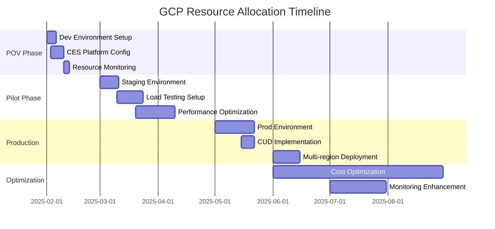

# GCP Resource Allocation Plan Template

*This template should be used for 7-implementation-plan/gcp-resource-allocation-plan.md*

## Executive Summary

[One-paragraph overview of GCP resource allocation strategy for project implementation phases]

## Resource Allocation Strategy

### Environment Strategy
```mermaid
graph TB
    subgraph "Development Phase"
        DEV[Development Environment<br/>- GCP Project: dev-[CLIENT]-fi<br/>- Region: us-central1<br/>- Budget: $[Amount]/month]
    end

    subgraph "Testing Phase"
        STAGING[Staging Environment<br/>- GCP Project: staging-[CLIENT]-fi<br/>- Region: us-central1<br/>- Budget: $[Amount]/month]
    end

    subgraph "Production Phase"
        PROD[Production Environment<br/>- GCP Project: prod-[CLIENT]-fi<br/>- Region: us-central1 (primary)<br/>- Budget: $[Amount]/month]
        DR[Disaster Recovery<br/>- Region: us-east1<br/>- Budget: $[Amount]/month]
    end

    DEV --> STAGING
    STAGING --> PROD
    PROD -.-> DR
```

## Phase-Specific Resource Allocation

### Phase 1: POV Development (Weeks 1-6)

#### Compute Resources
```yaml
POV_Compute_Allocation:
  cloud_run_services:
    chat_ui:
      cpu: "1 vCPU"
      memory: "512 MB"
      max_instances: 5
      estimated_cost: "$[Amount]/month"

    webhook_processor:
      cpu: "0.5 vCPU"
      memory: "256 MB"
      max_instances: 3
      estimated_cost: "$[Amount]/month"

  ces_platform:
    conversation_quota: "10,000 queries/month"
    voice_processing: "100 minutes/month"
    estimated_cost: "$[Amount]/month"
```

#### Storage & Data Resources
```yaml
POV_Storage_Allocation:
  cloud_storage:
    synthetic_data_bucket:
      storage_class: "Standard"
      estimated_size: "10 GB"
      estimated_cost: "$[Amount]/month"

  firestore:
    session_management:
      reads: "50,000/month"
      writes: "25,000/month"
      estimated_cost: "$[Amount]/month"

  bigquery:
    analytics_dataset:
      storage: "5 GB"
      queries: "100 queries/month"
      estimated_cost: "$[Amount]/month"
```

#### Networking & Integration
```yaml
POV_Network_Allocation:
  vpc_network:
    configuration: "Regional VPC in us-central1"
    estimated_cost: "$[Amount]/month"

  cloud_nat:
    configuration: "Single NAT gateway for egress"
    estimated_cost: "$[Amount]/month"

  load_balancer:
    type: "Global HTTP(S) Load Balancer"
    estimated_traffic: "1 TB/month"
    estimated_cost: "$[Amount]/month"
```

**Total POV Monthly Cost**: $[Amount]

### Phase 2: Pilot Implementation (Months 2-4)

#### Scaling Considerations
```yaml
Pilot_Scaling_Factors:
  user_growth:
    target_users: "[Number] concurrent users"
    conversation_volume: "[Number] conversations/day"
    peak_load_multiplier: "3x average load"

  feature_expansion:
    additional_agents: "2 specialized agents"
    integration_testing: "Limited external system connections"
    performance_testing: "Load testing infrastructure"
```

#### Resource Increases
```yaml
Pilot_Resource_Scaling:
  compute_scaling:
    cloud_run_instances: "Scale to 15 max instances"
    ces_conversation_quota: "50,000 queries/month"
    additional_services: "Testing and monitoring tools"
    estimated_cost_increase: "+$[Amount]/month"

  storage_scaling:
    data_storage: "Scale to 100 GB"
    backup_strategy: "Daily automated backups"
    estimated_cost_increase: "+$[Amount]/month"

  monitoring_addition:
    cloud_monitoring: "Advanced monitoring suite"
    cloud_logging: "Centralized logging with retention"
    estimated_cost: "+$[Amount]/month"
```

**Total Pilot Monthly Cost**: $[Amount]

### Phase 3: Production Deployment (Months 5-12)

#### Production-Grade Resources
```yaml
Production_Architecture:
  high_availability:
    multi_region: "us-central1 (primary), us-east1 (secondary)"
    auto_failover: "Automated disaster recovery"
    uptime_target: "99.9% availability SLA"

  scalability:
    ces_enterprise_tier: "Enterprise CES subscription"
    conversation_capacity: "500,000 queries/month"
    concurrent_users: "10,000+ simultaneous users"

  security_enhancements:
    vpc_service_controls: "Secure perimeter for data"
    private_google_access: "No public IP requirements"
    cloud_hsm: "Hardware security modules for encryption"
```

#### Production Resource Allocation
```yaml
Production_Compute:
  google_kubernetes_engine:
    cluster_config:
      node_pools: "3 pools (system, application, batch)"
      machine_types: "n2-standard-4 for application workloads"
      min_nodes: 6
      max_nodes: 50
      estimated_cost: "$[Amount]/month with CUDs"

  ces_production:
    enterprise_subscription: "$[Amount]/month base"
    conversation_volume: "$[Amount]/month for usage"
    premium_features: "$[Amount]/month for advanced AI"

Production_Storage:
  cloud_sql:
    instance_type: "db-n1-standard-8"
    storage: "1 TB SSD with automatic backups"
    high_availability: "Regional persistent disk"
    estimated_cost: "$[Amount]/month"

  persistent_disks:
    application_data: "500 GB SSD per region"
    backup_storage: "Nearline storage for long-term retention"
    estimated_cost: "$[Amount]/month"

Production_Network:
  global_load_balancer: "$[Amount]/month for multi-region traffic"
  cloud_cdn: "$[Amount]/month for content delivery"
  interconnect: "$[Amount]/month for dedicated connectivity"
```

**Total Production Monthly Cost**: $[Amount]

## Cost Optimization Implementation

### Committed Use Discounts (CUDs) Strategy

#### 1-Year Commitments
```yaml
Year_1_CUD_Strategy:
  compute_engine:
    commitment: "100 vCPU hours/month minimum"
    discount: "25% on committed usage"
    estimated_savings: "$[Amount]/year"

  cloud_sql:
    commitment: "2 db-n1-standard-4 instances"
    discount: "17% on committed usage"
    estimated_savings: "$[Amount]/year"

Total_Year_1_CUD_Savings: "$[Amount]/year"
```

#### 3-Year Commitments (Year 2+)
```yaml
Long_Term_CUD_Strategy:
  compute_engine:
    commitment: "200 vCPU hours/month"
    discount: "57% on committed usage"
    estimated_savings: "$[Amount]/year"

  kubernetes_engine:
    commitment: "Cluster management fees"
    discount: "Sustained use + CUD benefits"
    estimated_savings: "$[Amount]/year"

Total_3_Year_CUD_Savings: "$[Amount]/year"
```

### Resource Optimization Techniques

#### Development Environment Optimization
```yaml
Dev_Environment_Optimization:
  automated_scheduling:
    weekday_hours: "8 AM - 8 PM (12 hours)"
    weekend_schedule: "Shut down completely"
    savings_percentage: "67% cost reduction"
    estimated_savings: "$[Amount]/month"

  right_sizing:
    development_instances: "Reduce to n1-standard-2"
    staging_instances: "Scale down during off-hours"
    estimated_savings: "$[Amount]/month"
```

#### Storage Optimization
```yaml
Storage_Lifecycle_Management:
  cloud_storage_policies:
    standard_to_nearline: "After 30 days of no access"
    nearline_to_coldline: "After 90 days of no access"
    coldline_to_archive: "After 365 days of no access"
    estimated_savings: "50-80% on aged data"

  database_optimization:
    automated_backups: "Retain 30 days, then move to coldline"
    log_retention: "90 days active, then archive"
    estimated_savings: "$[Amount]/month"
```

### Monitoring & Budget Controls

#### Budget Hierarchy
```yaml
Budget_Structure:
  master_budget:
    total_monthly: "$[Amount]"
    alert_thresholds: [50%, 80%, 95%]

  environment_budgets:
    development: "$[Amount]/month (20% of total)"
    staging: "$[Amount]/month (15% of total)"
    production: "$[Amount]/month (65% of total)"

  service_budgets:
    ces_platform: "$[Amount]/month"
    compute_infrastructure: "$[Amount]/month"
    storage_services: "$[Amount]/month"
    networking: "$[Amount]/month"
```

#### Automated Cost Controls
```yaml
Cost_Control_Automation:
  budget_alerts:
    50_percent: "Email notification to project team"
    80_percent: "Escalation to project manager + cost review"
    95_percent: "Executive notification + spending freeze"
    100_percent: "Automatic scaling restrictions activated"

  resource_policies:
    instance_limits: "Maximum 50 compute instances per project"
    storage_quotas: "Alert at 80% of allocated storage"
    api_quotas: "Rate limiting on expensive API calls"
```

## Resource Allocation Timeline

### Implementation Schedule


### Resource Provisioning Checklist

#### Week 1: Foundation Setup
- [ ] **GCP Projects Created**: dev, staging, prod environments
- [ ] **Billing Accounts**: Configured with appropriate budgets and alerts
- [ ] **IAM Policies**: Role-based access control implemented
- [ ] **Network Setup**: VPC, subnets, and firewall rules configured
- [ ] **Resource Quotas**: Service quotas increased for anticipated usage

#### Week 2-3: Service Deployment
- [ ] **CES Platform**: Customer Engagement Suite configured and tested
- [ ] **Compute Services**: Cloud Run and GKE clusters deployed
- [ ] **Storage Services**: Cloud Storage buckets and Cloud SQL instances
- [ ] **Monitoring**: Cloud Monitoring and Logging configured
- [ ] **Security**: Security Command Center and audit logging enabled

#### Week 4-6: Testing & Validation
- [ ] **Load Testing**: Performance validation under expected load
- [ ] **Cost Validation**: Actual costs vs. projected costs analysis
- [ ] **Security Testing**: Penetration testing and vulnerability assessment
- [ ] **Backup Testing**: Disaster recovery procedures validated
- [ ] **Optimization**: Initial cost optimization measures implemented

## Team Resource Requirements

### GCP Expertise Requirements
```yaml
Team_Skill_Requirements:
  gcp_cloud_architect:
    skills: ["GCP Architecture", "CES Platform", "Cost Optimization"]
    time_allocation: "40 hours/week during setup phase"
    duration: "12 weeks"

  devops_engineer:
    skills: ["GKE", "CI/CD", "Infrastructure as Code"]
    time_allocation: "30 hours/week"
    duration: "16 weeks"

  security_engineer:
    skills: ["GCP Security", "Compliance", "Identity Management"]
    time_allocation: "20 hours/week"
    duration: "8 weeks"

  cost_optimization_specialist:
    skills: ["FinOps", "GCP Billing", "Resource Management"]
    time_allocation: "15 hours/week ongoing"
    duration: "Continuous"
```

### Training & Certification Plan
- **GCP Certification Target**: Professional Cloud Architect for 2 team members
- **CES Specialization**: Customer Engagement Suite training for 3 team members
- **FinOps Training**: Cloud cost management certification for 1 team member
- **Timeline**: 4-6 weeks for initial certifications
- **Budget**: $[Amount] for training and certification costs

## Risk Mitigation

### Resource-Related Risks

#### High-Impact Risks
1. **Resource Quota Limits**
   - **Risk**: GCP service quotas insufficient for peak loads
   - **Mitigation**: Pre-emptive quota increase requests, monitoring thresholds
   - **Cost Impact**: Potential service degradation, no direct cost increase

2. **Cost Overruns**
   - **Risk**: Actual usage exceeds projected consumption by 50%+
   - **Mitigation**: Automated budget controls, weekly cost reviews
   - **Cost Impact**: +$[Amount]/month additional costs

#### Medium-Impact Risks
3. **Service Dependencies**
   - **Risk**: GCP service outages affect multiple components
   - **Mitigation**: Multi-region deployment, service redundancy
   - **Cost Impact**: +$[Amount]/month for redundancy

4. **Skills Gap**
   - **Risk**: Team lacks specialized GCP/CES expertise
   - **Mitigation**: Training plan, consultant engagement
   - **Cost Impact**: +$[Amount] for training/consulting

## Success Metrics

### Cost Management KPIs
```yaml
Cost_Performance_Metrics:
  budget_variance:
    target: "Within 5% of monthly budget"
    measurement: "Monthly budget vs actual spend"

  optimization_effectiveness:
    target: "20% cost reduction through optimizations"
    measurement: "Savings from CUDs, rightsizing, scheduling"

  resource_utilization:
    target: ">75% average utilization"
    measurement: "Compute, storage, and network utilization rates"
```

### Operational KPIs
```yaml
Operational_Metrics:
  availability:
    target: "99.9% uptime"
    measurement: "Service availability monitoring"

  performance:
    target: "<2 second response time"
    measurement: "Application performance monitoring"

  scalability:
    target: "Support 10x traffic growth"
    measurement: "Load testing and capacity planning"
```

## Recommendations

### Immediate Actions (Week 1)
1. **Establish GCP billing structure** with hierarchical budgets and alerts
2. **Configure resource quotas** for anticipated peak usage
3. **Implement basic monitoring** for cost and resource utilization

### Short-term Actions (Month 1)
1. **Deploy automated cost controls** including budget-based scaling restrictions
2. **Implement resource tagging strategy** for detailed cost attribution
3. **Establish performance baselines** for optimization targeting

### Long-term Actions (Months 2-6)
1. **Optimize with Committed Use Discounts** based on usage patterns
2. **Implement advanced automation** for resource lifecycle management
3. **Establish FinOps practices** for continuous cost optimization

## Conclusion

This GCP resource allocation plan provides a **structured approach to managing cloud resources** throughout the project lifecycle:

### Key Benefits
- **Cost Predictability**: Clear budget allocation and monitoring for each phase
- **Scalability**: Resource plan supports growth from POV to enterprise scale
- **Optimization**: Built-in cost optimization strategies from day one
- **Risk Management**: Proactive identification and mitigation of resource risks

### Success Factors
- **Phased Approach**: Gradual scaling reduces risk and enables learning
- **Automation**: Automated controls prevent cost overruns and optimize resources
- **Monitoring**: Continuous visibility into costs and resource utilization
- **Team Expertise**: Proper training and certification for effective management

**Total Resource Investment**: $[Amount] over 12 months
**Expected Optimization Savings**: $[Amount]/year through GCP best practices
**ROI on Resource Management**: [X]% improvement in cost efficiency

---

*Resource allocation plan prepared: [Date]*
*Based on GCP pricing and resource requirements analysis*
